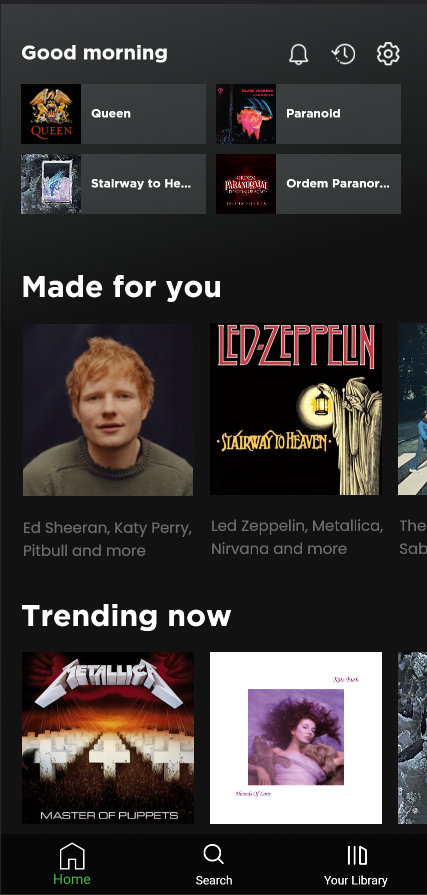
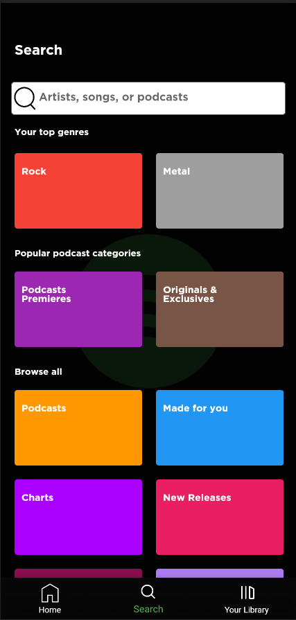
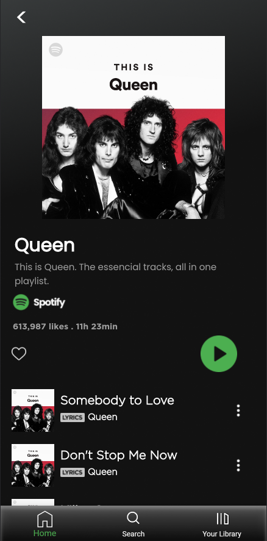

> # Spotify Clone
>> In this project, I create the main features of the famous app Spotify.     Neste projeto recreei as principais funcionalidades do famoso app Spotify.    
>>   
>>✅ $~~~$ [Home Screen](#home-screen)  
✅ $~~~$ Playlists  
✅ $~~~$ [Search Page](#search-page)  
✅ $~~~$ [Playlist Screen](#playlist-screen)  
⌛ $~~~$ Songs  
⌛ $~~~$ Music Player
 
                                                    
 

  

 * ## Home Screen
  

 

 * ## Search Page
 

 

 * ## Playlist Screen

  

>## Tecnologias usadas: 

>> $~~~$ | $~~~$
 $~~~$ | $~~~$
 $~~~$ | $~~~$
 $~~~$ |

